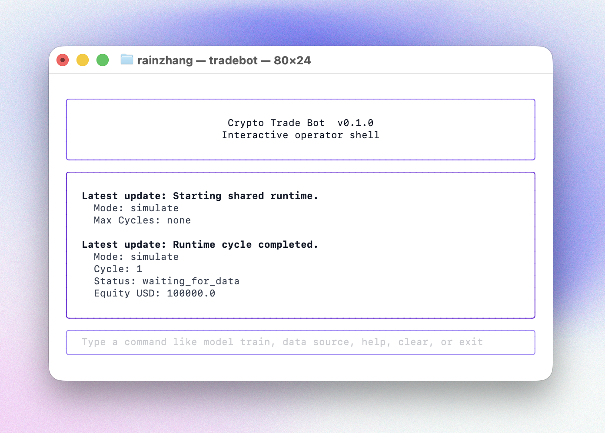

# Crypto Trade Bot

CLI-first Kraken spot trading bot with an interactive operator shell for research, simulation, and live operations.

<p align="center">
  
</p>

Crypto Trade Bot packages the repository’s documented Kraken-only workflow into a single `tradebot` command. On interactive terminals it opens the operator shell by default, while the full direct command surface remains available for automation, data preparation, backtesting, simulation, and live runtime tasks.

## Quickstart

Install `pipx` and the package:

```bash
python3 -m pip install --user pipx
pipx ensurepath
pipx install CryptoTradeBot
```

Open the shell from anywhere in your terminal with:

```bash
tradebot
```

`tradebot` launches the interactive operator shell after the package is installed.

On first launch, `tradebot` creates the default application home under `~/.tradebot/`.

## Docs

- [Crypto Trade Bot Documentation](docs/README.md)
- [Commands](docs/shell-commands.md)

This repository is licensed under the [MIT License](LICENSE).
